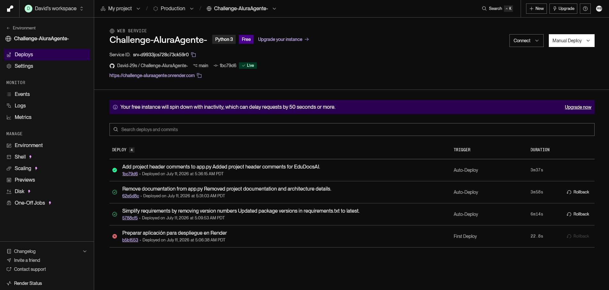
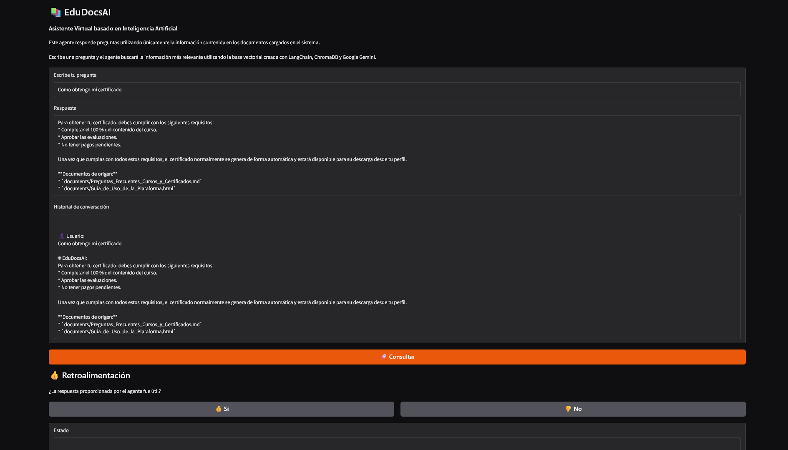
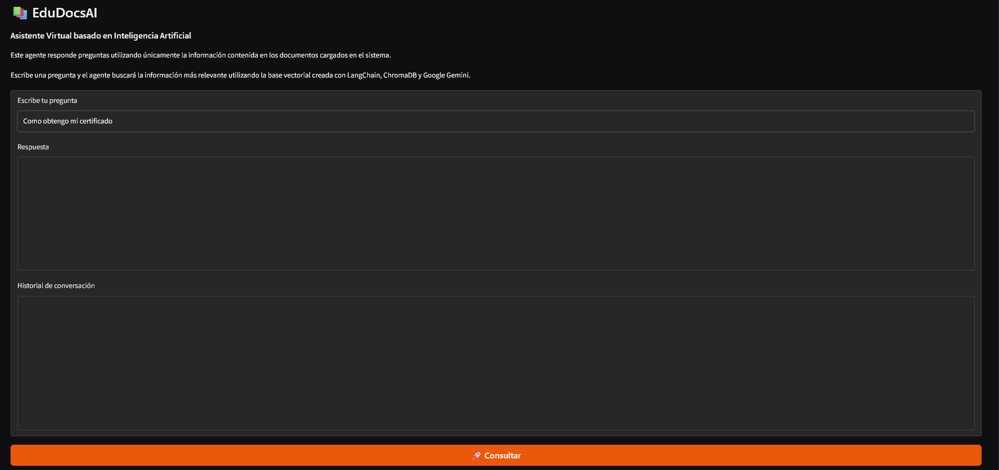
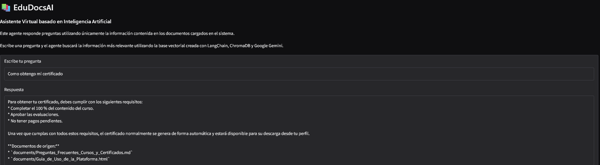
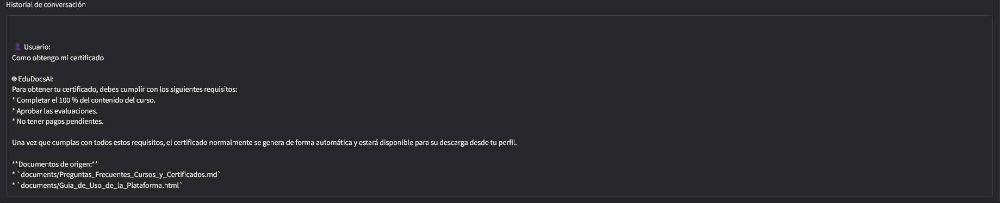
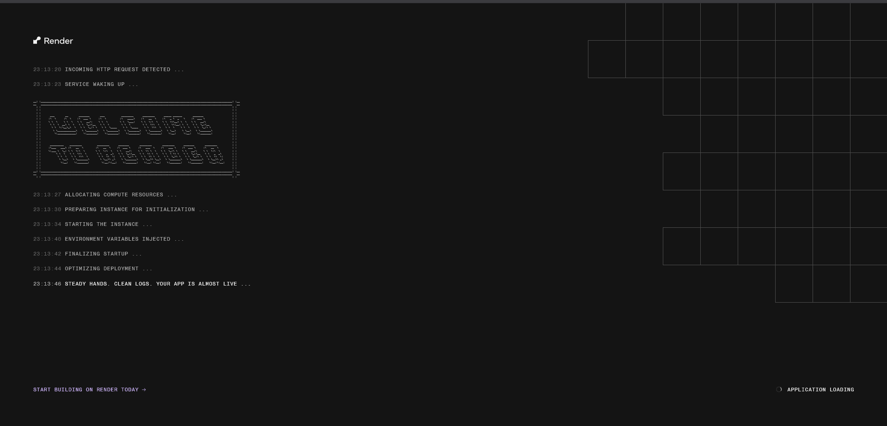

# 📚 EduDocsAI

### Agente RAG con Google Gemini, LangChain, ChromaDB y Gradio

> Asistente inteligente basado en **Retrieval-Augmented Generation (RAG)**.

---

# 🌐 Demo

**Aplicación desplegada en Render**

https://challenge-aluraagente.onrender.com

---

# 📖 Descripción

EduDocsAI es un proyecto desarrollado para el Challenge Alura ONE. Implementa un sistema RAG que carga documentos, genera embeddings con Google Gemini, almacena el conocimiento en ChromaDB y responde preguntas mediante LangChain.

---

# ✨ Características

- Arquitectura RAG completa
- Google Gemini
- LangChain
- ChromaDB
- Gradio
- Historial de conversación
- Retroalimentación
- Despliegue automático con GitHub + Render

---

# 🧠 Arquitectura

```text
Documentos
    │
    ▼
Carga
    │
    ▼
Chunking
    │
    ▼
Embeddings
    │
    ▼
ChromaDB
    │
    ▼
Retriever
    │
    ▼
Gemini
    │
    ▼
Respuesta
```

---

# 📂 Estructura del proyecto

```text
EduDocsAI/
│
├── app.py
├── requirements.txt
├── README.md
├── MANTENIMIENTO.md
├── .gitignore
│
├── documents/
│
├── images/
│   ├── 01_render_dashboard.png
│   ├── 02_application.png
│   ├── 03_question.png
│   ├── 04_response.png
│   ├── 05_history.png
│   └── 06_runtime_logs.png
│
├── chroma_db/
└── notebook/
```

---

# 🛠 Tecnologías

- Python
- Google Gemini
- LangChain
- ChromaDB
- Gradio
- Git
- GitHub
- Render

---

# ⚙️ Instalación

```bash
pip install -r requirements.txt
python app.py
```

Configura:

```text
GOOGLE_API_KEY=TU_API_KEY
```

---

# ☁️ Despliegue

La aplicación se encuentra desplegada en Render y se actualiza desde GitHub.

---

# 📸 Registro de ejecución en la nube

## 1. Servicio desplegado

<p align="center">

</p>

## 2. Inicio de la aplicación

<p align="center">

</p>

## 3. Consulta realizada

<p align="center">

</p>

## 4. Respuesta generada

<p align="center">

</p>

## 5. Historial de conversación

<p align="center">

</p>

## 6. Runtime Logs

<p align="center">

</p>

---

# 📚 Aprendizajes

- Arquitectura RAG
- Embeddings
- Búsqueda semántica
- Prompt Engineering
- LangChain
- Git y GitHub
- Deploy con Render

---

# 🚀 Mejoras futuras

- LangGraph
- Docker
- FastAPI
- PostgreSQL + pgvector
- Memoria conversacional

---

# 👨‍💻 Autor

**David Sanchez**

Proyecto desarrollado para el Challenge Alura ONE.

---

# 📄 Licencia

Proyecto con fines educativos.
